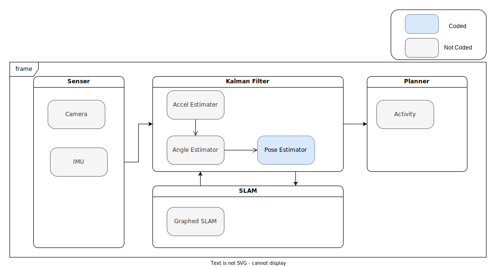
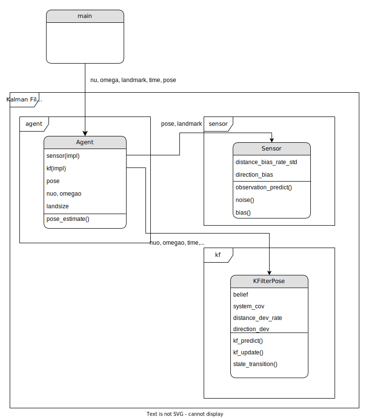

# ロボット走行技術を用いた技術ポートフォリオ
本ページはロボット走行技術のポートフォリオになります。
本ポートフォリオにて使用している技術は以下になります。
* カルマンフィルタ
* SLAM(作成中)
* Rust言語による実装

## Architecture Abstract

## Software Object
### Kalman Filter

### Graphed SLAM
作成中

## CI/CD

Devops面では、アジャイル開発による機能のupdateを実施するため自動化でテスト環境を作成。(Github Action)
* [設定ファイル](https://github.com/hender14/robotics/tree/devlop/.github/workflows/robotics.yml)

### Test

Testは、Github Actionによって自動的に行われます。

#### 設定ファイル
* [テストファイル](https://github.com/hender14/robotics/tree/devlop/tests/testkf.rs)