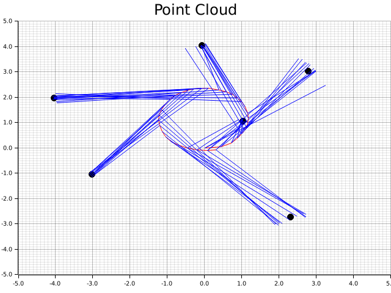

# ロボット走行技術を用いた技術ポートフォリオ
本ページはロボット走行技術に関するポートフォリオになります。
本ポートフォリオで使用している技術は以下になります。

* ロボット制御技術(カルマンフィルタ, SLAM)の使用
* Rust言語による実装
* Github Actionsによる自動CI環境

## Application abstract
* 自律走行ロボットのシミュレーション

### アプリケーション詳細
* ロボット概要

対向２輪型ロボットのシミュレーションを行います。モータ動作で駆動輪の制御を行い、モータ回転速度を変更する事で、その場での回転や曲線を描きながらの移動を実現させます。

* センサ概要

位置推定のために、ロボットの周囲に6つのランドマークを設置しています。ランドマークはロボットを観測すると、ロボットとの距離、角度情報をロボットへ送信します。このデータを元に、オドメトリを算出していきます。センサデータ自体にバイアスがあり、十分な補正ができていないため、実際の位置とは乖離が発生しています。

* 制御概要

カルマンフィルタ及びグラフSLAMによって、ロボットの状態を推定します。
前者に関しては、システムの動作モデルを元に状態を推定して、その後センサデータを元にカルマンゲインを算出して状態を更新していきます。
後者は、カルマンフィルタによって取得したデータを元に、ロボットの状態や制約に関するグラフを作成して、制約を満たすようにグラフ構造を最適化していきます。最適化は最小二乗法を用いています。

尚、制御をシンプルにするため、速度、角速度、センサデータ取得周期は一定で動作しており、センサデータ取得、受信までにタイムラグがない事とします。

* 出力

outディレクトリにまとめています。
ロボットの状態や制約に関してはtxtファイルに記載、またロボット、ランドマークの状態はグラフにpng形式で出力しています。パラメータが適切でないため、少しエッジがバラついていますが、SLAMの実施前後で各ランドマークににエッジが集約している事が分かります。

|SLAM実施前|SLAM実施後|
|---|---|
|||

## Logical model

## Software Architecture

現状の実装内容(カルマンフィルタ、SLAM)からアーキテクチャを作成しました。

保守性、効率性の観点から、Clean Archtectureを採用。「外側(下記図の上側)のレイヤは内側(下記図の下側)のレイヤだけに依存する」というルールを守ることによって，内部のドメインロジックと外部の実装を分離して、既存のコンポーネントの置き換えを容易にできます。アプリケーション部に限って言えば、カルマンフィルタ、SLAMはアルゴリズムが複雑になる傾向にあるが、ドメイン、アプリケーション層と分離する事でドメインを独立させ、修正やテストを容易にできます。

尚、依存性の注入はまだ実装できていません。

## CI環境

Devops面では、アジャイル開発による機能のupdateを実施するため自動化でテスト環境を作成。(Github Action)

### 実施内容
* Rustフォーマッタの実行
* 静的解析ツールClippyの実行
* テストの実行

[設定ファイル](https://github.com/hender14/robotics/tree/devlop/.github/workflows/robotics.yml)

### Test

Testは、githubへコミットした際にGithub Actionによって自動的に行われます。

#### 設定ファイル
* [Kalman Filter](https://github.com/hender14/robotics/tree/devlop/tests/test_kf.rs)
* [Graphed SLAM](https://github.com/hender14/robotics/tree/devlop/tests/test_slam.rs)

※テスト内容は暫定になります。