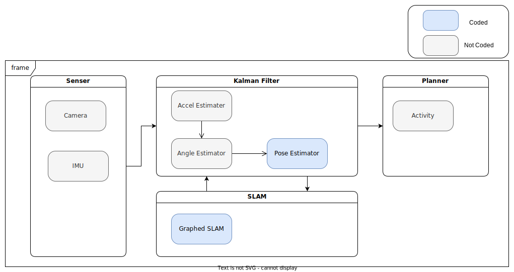

# ロボット走行技術を用いた技術ポートフォリオ
本ページはロボット走行技術のポートフォリオになります。
本ポートフォリオにて使用している技術は以下になります。
* ロボット制御技術(カルマンフィルタ, SLAM)の使用
* Rust言語による実装
* Github Actionsによる自動CI環境

## Logical model

## Software Architecture

現状の実装内容(カルマンフィルタ、SLAM)からアーキテクチャを作成しました。

保守性、効率性の観点から、Clean Archtectureを採用。「外側(下記図の上側)のレイヤは内側(下記図の下側)のレイヤだけに依存する」というルールを守ることによって，内部のドメインロジックと外部の実装を分離して、既存のコンポーネントの置き換えを容易にできます。アプリケーション部に限って言えば、カルマンフィルタ、SLAMはアルゴリズムが複雑になる傾向にあるが、ドメイン、アプリケーション層と分離する事でドメインを独立させ、修正やテストを容易にできます。

尚、依存性の注入はまだ実装できていません。

## CI環境

Devops面では、アジャイル開発による機能のupdateを実施するため自動化でテスト環境を作成。(Github Action)

### 実施内容
* Rustフォーマッタの実行
* 静的解析ツールClippyの実行
* テストの実行

[設定ファイル](https://github.com/hender14/robotics/tree/devlop/.github/workflows/robotics.yml)

### Test

Testは、githubへコミットした際にGithub Actionによって自動的に行われます。

#### 設定ファイル
* [Kalman Filter](https://github.com/hender14/robotics/tree/devlop/tests/test_kf.rs)
* [Graphed SLAM](https://github.com/hender14/robotics/tree/devlop/tests/test_slam.rs)

※テスト内容は暫定になります。